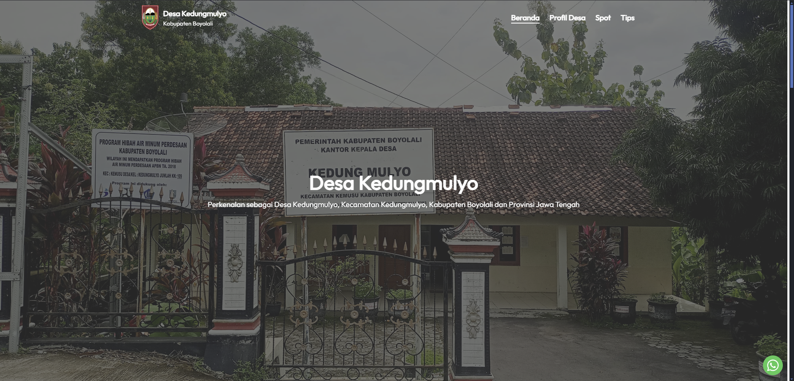
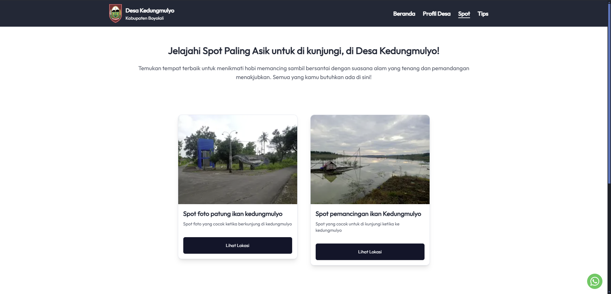

# 🌍 Web Desa Kedungmulyo


Website resmi Desa Kedungmulyo yang menyediakan berbagai informasi penting, layanan online, serta fitur **Spot** dan **Tips** untuk kemudahan akses bagi masyarakat.

## 🔗 Live Demo
👉 [desakedungmulyo.vercel.app](https://desakedungmulyo.vercel.app/)

## 🖼️ Tampilan Website
### 🏠 Halaman Utama


### 📍 Fitur Spot


## 📌 Fitur Utama
- **Informasi Desa** → Berita, pengumuman, dan sejarah Desa Kedungmulyo
- **Spot** → Menampilkan tempat penting dan lokasi strategis di desa
- **Tips** → Kumpulan panduan dan tips bermanfaat untuk warga
- **Responsive Design** → Optimal di berbagai perangkat

## 🛠️ Teknologi yang Digunakan
- **Next.js** → Framework React untuk performa optimal
- **Tailwind CSS** → Styling modern dan responsif
- **Vercel** → Deployment yang cepat dan aman

## 📥 Instalasi dan Penggunaan
```bash
# Clone repository
$ git clone https://github.com/MomoPi-Dark/Web-Desa-Kedungmulyo.git

# Masuk ke folder project
$ cd Web-Desa-Kedungmulyo

# Install dependencies
$ npm install

# Jalankan proyek secara lokal
$ npm run dev
```
Akses website di `http://localhost:3000`

## 📜 Lisensi
Proyek ini berlisensi **MIT License** - Bebas digunakan dan dikembangkan lebih lanjut!

---

💡 **Dikelola oleh:** [Gamflaz](https://github.com/MomoPi-Dark)
